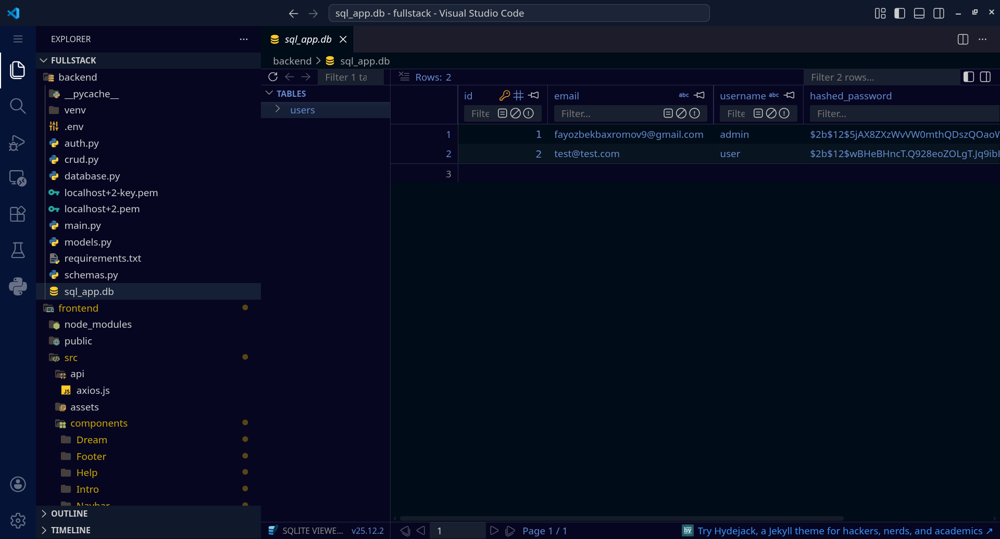
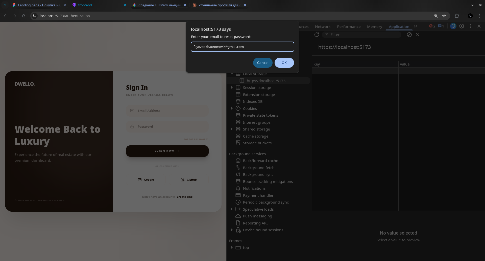
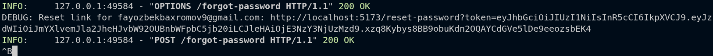
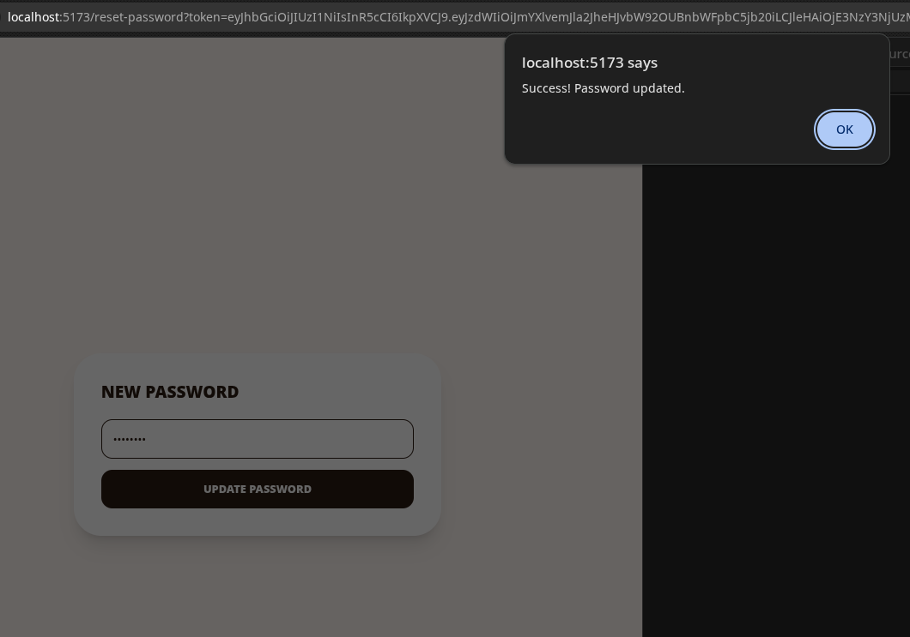

# 🏛️ Dwello — Платформа элитной недвижимости

Современный премиальный маркетплейс недвижимости со встроенной системой безопасной аутентификации.

> 🤖 **Примечание по разработке:** Архитектура, основные алгоритмы и логика бэкенда были спроектированы при поддержке **Google Gemini AI**. Это позволило достичь высокой скорости разработки, отличной производительности и строгого следования стандартам безопасности RESTful API.

---

## ✨ Технологический стек

| Слой            | Используемые технологии                                        |
| :-------------- | :------------------------------------------------------------- |
| **Frontend**    | `React 19` • `Vite` • `Tailwind CSS` • `Framer Motion` • `AOS` |
| **Backend**     | `Python` • `FastAPI` • `SQLAlchemy` • `JWT (Jose)` • `Passlib` |
| **База данных** | `SQLite` (через мощную абстракцию SQLAlchemy ORM)              |
| **UI / UX**     | Стеклянный дизайн (`Glassmorphism`) • Иконки `Lucide React`    |

---

## 📸 Превью интерфейса

Для идеального отображения скриншоты объединены в аккуратную адаптивную сетку:

  <table border="0">
    <tr>
      <td></td>
      <td></td>
    </tr>
    <tr>
      <td></td>
      <td></td>
    </tr>
  </table>

---

  💎 <i>Чистый код. Премиальный дизайн. Поддержка AI.</i>

